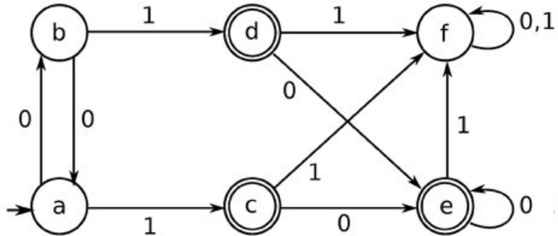
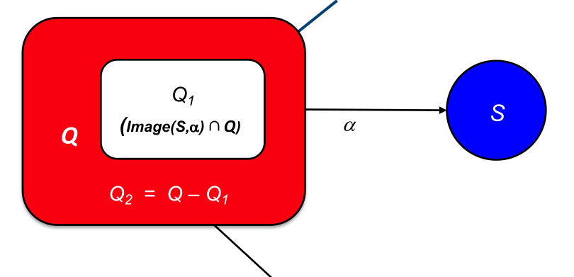

## DFA To Minimal DFA 
### Minimal DFA
* ```不可达状态``` 　DFA在任意输入串下都无法达到的状态 (正常情况下会有 re 生成这样的 DFA 吗?
  *  ```BFS``` or ```DFS```
* ```等价状态```　 在同一输入串下不产生区别的状态
Two states $s_i$ and $s_j$ are behaviorally equivalent **if and only if**:
  * The set of paths leading from $s_i$ & $s_j$ are equivalent  　// transition 相同
  * $ \forall c \in \Sigma$, transitions from $s_i$ & $s_j$ on $c$ lead to equivalent states　//结果相同



### The Cycle of Constructions
#### Hopcroftʼs algorithm
* for $D = (D, \Sigma,\delta,s_0 ,D_A )$ :

  1. 初始划分 : $ P_0 $ has two sets: {$D_A$} & {$D – D_A$} 
  2. 基于转换，迭代地细分这些集合
     * Assume $s_i$&$s_j$$\in$$p_s$ , $s_i$ has transition on $a$, $s_j$ does not,$a$ splits $p_s$
     *  $\delta(s_i,a) = s_x ,\delta(s_j ,a) = s_y$,if $s_x$ & $s_y$ are not in the same set $p_t$,$a$ splits $p_s$
  3. 直至每一个$p_s$不能再划分，则它成为 DFA 中的一个 state

* tips：
  * $Q_1 \leftarrow \delta( S, a ) ∩ Q$ 
  * $Q_2$ must have an a-transition to **one or more other states** in one or more other partitions (e.g., R & S), or
states **with no a-transitions**

* pseudo-code :
  > Worklist ← $\{ D_A , \{ D-D_A \} \}$
  Partition ← $\{ D_A , \{ D-D_A \} \}$
  While (Worklist ≠ ∅) do
  　select a set S from Worklist and remove it
  　for each α ∈ Σ do
  　　Image ← { x | δ(x, α) ∈ S } 　// Image is the set of states that have a transition into S on α : $δ^{-1}(S,α)$
  　　for each $q$ ∈ Partition that has a state in Image do
 　　　$q_1 ← q∩Image$
  　　　$q_2 ← q–q_1$
  　　　if $q_2 ≠ ∅$ then
  　　　　 remove $q$ from Partion
 　　　　 Partition ← Partition $∪ q_1 ∪ q_2$
 　　　　 if $q ∈$ Worklist then
 　　　　　 remove q from Worklist
 　　　　　 Worklist ← Worklist $∪ q_1 ∪ q_2$
　　　　  else if $|q_1 | ≤|q_2|$
 　　　　　 then Worklist ← Worklist $∪ q_1$
 　　　　　 else Worklist ← Worklist$ ∪ q_2$
 　　　　 if $s = q$ then
 　　　　　 break; // cannot keep working on s


#### Brzozowski’s algorithm
