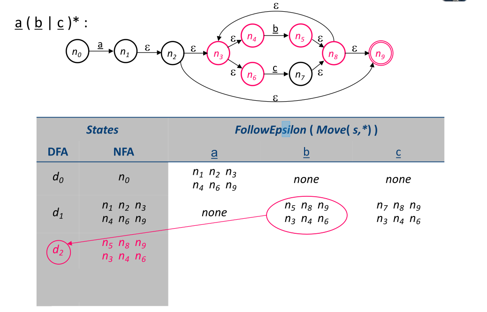

## NFA to DFA

#### Automaton
An NFA is represented formally by a 5-tuple, ${\displaystyle (N,\Sigma ,\Delta ,n_0,N_A)}$, consisting of

* a finite set of states $N$
* a finite set of input symbols  $\Sigma$
* a transition function $\Delta  : {\displaystyle N\times \Sigma \rightarrow P(N)}$
* an initial (or start) state $n_{0}\in N$
* a set of states $N_A$ distinguished as accepting (or final) states $N_A\subseteq N$
### core
* 若状态 B，C，D 可以由同一(或多)个状态 A 通过同一个 transition 得到, 那么状态 B，C，D 等价

* BFS 广度优先搜索
### Subset Construction 
#### Two key support functions
* Move($n_i$ , a) is the set of states reachable from $n_i$ by a
* FollowEpsilon($n_i$) is the set of states reachable from $n_i$ by ε
####　Algorithm

>$d_0$ <— FollowEpsilon( {$n_0$} ) // $d_0$ is set of states 
D <— { $d_0$ }  //所有该 NFA 可能的 DFA 的集合，最大 $2^N$ 种
W <— { $d_0$ }// work sets
while (W != ∅)
{ 
    　select and removes $s$ from W
   　 for each $a \in \Sigma$  
     　{
    　　　 t <— FollowEpsilon(Move(s,$a$))
      　　　   T[s,$a$] <— t　　//Ｔ is trasnsition set like <<$State_0$,ch>,$State_1$>
     　　　 if (t $ \notin$ D) then 
     　　 {
         　　   add t to D
          　   　add t to W
          　　  }
 　} 
 }

