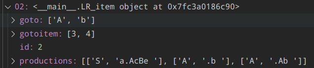
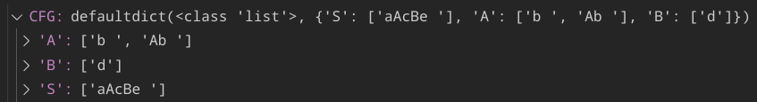
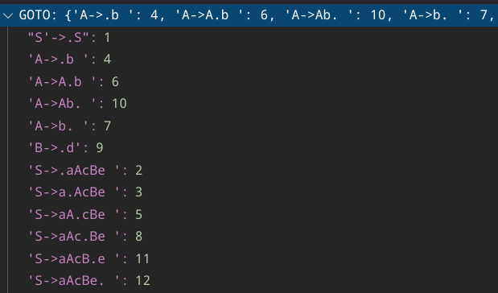
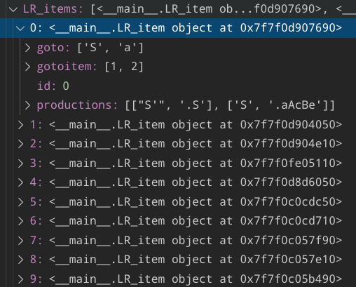
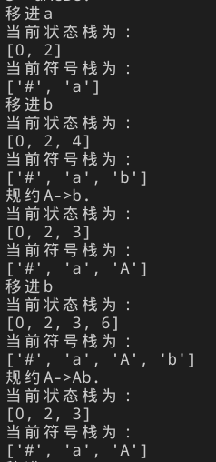
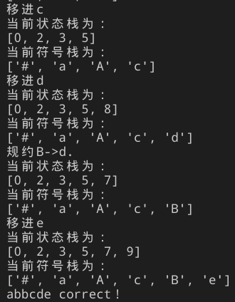

# LR0 分析

## Data Structure

- Items : list [ object ]
  Items = [ Item_0,Item_1,...,Item_n ]

- Item
  - 保存转移状态，方便生成 LR(0)分析表

```python
class LR_item(object):
    def __init__(self,id):
        self.goto = []  #char  记录当前项目集可移进字符
        self.gotoitem = []  #int
        self.productions = []
        self.id = id #可以省略，直接根据 items 索引来确定
```



- CFG：dict&list
  CFG={ lh_0:[rh_0,rh_1] , lh_1:[rh_0,rh_1] }
  - 主要作用：求闭包



- GOTO：dict()

  - 全局变量 GOTO {string,int} 产生式->项目/状态集编号



## 构造识别活前缀的 DFA

p134 第三种方法

1. 拓广文法（同时生成初始项目集）

   - 为了简便，这里的输入：

   ```
   S     - 第一行单独字符指明 start 字符
   S->aAcBe
   A->b      - 默认大写字母是非终结符，其余为终结符
   A->Ab    - 以 -> 作为分隔符
   B->d
   ```

   - 该函数就是一个最基本的读取文件，字符串处理

```python

def load_CFG(filename):
    LR_items = []
    from collections import defaultdict
    CFG = defaultdict(list)
    with open(filename, 'r') as file:
        line = file.readline().replace('\n', '')
        lr_item = LR_item(0)
        #拓广文法
        start=line
        lr_item.productions.append([line + "'", "."+line])
        line=file.readline().replace('\n', '')
        while (line):
            line=line.split("->")
            CFG[line[0]].append(line[1])
            if(line[0]==start):
                lr_item.productions.append([line[0], "."+line[1]])
            line = file.readline().replace('\n', '')
    LR_items.append(lr_item)
    file.close()
    return LR_items,CFG
```

2.  将拓广文法的第一个项目$S'->\cdot S$ 作为初态集的核，通过求核的闭包和转换函数，求出项目集

    1. 求闭包:$if A \rightarrow \alpha \cdot B \beta ,then B \rightarrow \cdot \gamma1$
       遍历当前项目集每一条产生式

    ```python
     while(i<len(cur_item.productions)):
         rh =cur_item.productions[i][1]
         #若 . 已经在结尾，直接跳过
         index=rh.index('.')
         if (index == len(rh) - 1):
             i+=1
             continue
         lookahead=rh[index+1]
         get_closure(lookahead, cur_item, CFG)
         i+=1
    ```

    - 输入：lookahead,item,CFG
    - 输出：item 的闭包

    ```python

    def get_closure(char, LR0_item, CFG):
        #若是终结符
        if not char.isupper():
            return
        else:
        #非终结符
            for i in range(0, len(CFG[char])):
                rh = "." + CFG[char][i]
                new=[char, rh]
                if new not in LR0_item.productions:
                    LR0_item.productions.append(new)
    ```

    2.  转换函数的生成

    遍历每一个项目集

    ```python
     while (itemid < len(LR_items)):
        get_LR0_items(LR_items, CFG, itemid)
        itemid+=1
    ```

    遍历项目集中的每一个产生式

    ```python
     for i in range(0, len(cur_item.productions)):
        lh = cur_item.productions[i][0]
        rh = cur_item.productions[i][1]
        production=lh+"->"+rh
        #若 . 已在末尾，即规约项目，跳过
        index=rh.index('.')
        if (index == len(rh) - 1):
            print(production)
            continue
        lookahead=rh[index+1]
        new_itemid = len(LR0_items)
        #否则
        #对每一个有可能的符号转移，生成一个新的对应的状态集
        #不需要遍历符号表，减小开销
        if lookahead not in cur_item.goto:
            if production not in GOTO:
                #项目集对象中的 goto 保存的是当前项目集所有产生式能移进的字符的并集
                new_lr_item = LR_item(new_itemid)
                pos = rh.index('.')
                #移进！交换 . 和 后一个字符的位置
                rh=swap(rh,pos,pos+1)
                new_lr_item.productions.append([lh, rh])

                cur_item.goto.append(lookahead)
                cur_item.gotoitem.append(new_itemid)

                GOTO[production] = new_itemid

                LR0_items.append(new_lr_item)
            else:
                #全局GOTO表中已经存在
                #全局GOTO表保存的实际是某一个项目集中`一个确定的产生式`移进所到达的`项目集编号`
                #若后续在其他项目集中有一样的产生式，直接采用它即可

                cur_item.goto.append(lookahead)
                cur_item.gotoitem.append(GOTO[production])
            print(production+"\t\tgoto("+lookahead+")="+"I"+str(GOTO[production]))
        else:
            #若curitem中goto存在lookahead
            #即当前item某个产生式移进对应的 item 已经生成
            #移进,若不冲突则加入该 goto_item

            #对应的是 Item:A->bA,A->bcD,A->bB 这种情况

            pos = rh.index('.')
            rh = swap(rh, pos, pos + 1)

            index=cur_item.goto.index(lookahead)

            goto_itemid=cur_item.gotoitem[index]
            goto_item=LR0_items[goto_itemid]
            if [lh, rh] not in goto_item.productions:
                goto_item.productions.append([lh,rh])

            rh = swap(rh, pos, pos + 1)
            print(lh+"->"+rh)
    ```

至此，得到了识别活前缀的 DFA。



## 构造 LR(0)分析表

p135 action 和 goto 不会冲突，在实际应用中直接将他们重叠，用同一数组元素表示

遍历上述过程得到的项目集即可。

其实每个项目集对象中`goto`以及`gotoitem`已经指明了分析表的转换。其中规约或结束状态的`goto`，`gotoitem`均为空。

## 输入符号串进行分析

输入`abbcde`进行分析

```python

    State = [0] #状态栈
    Char = ['#'] #符号栈
    input_string = list("abbcde#")
    for i in input_string:
        if i == "#":
            print(inputs[0] + " correct！")
            break

        #获取当前项目集
        cur_item = LR_items[State[-1]]

        #若按照上述方式得到项目集，那么当item goto为空时，说明应该规约/终结
        if cur_item.goto == []:
            handle=cur_item.productions[0][0]
            rh = cur_item.productions[0][1]
            print("规约"+handle+"->"+rh)

            #符号栈出栈 生成式右端长度
            for j in range(0, len(rh)-1):
                Char.pop()
            Char.append(handle)
            State.pop()
            pre_item = LR_items[State[-1]]

            #获取状态栈应加入的 新项目集id
            #即在状态栈上一个项目集的 gotoitem 中
            if handle in  pre_item.goto:
                index=pre_item.goto.index(handle)
                new_state=LR_items[State[-1]].gotoitem[index]
                State.append(new_state)
            print("当前状态栈为：")
            print(State)
            print("当前符号栈为：")
            print(Char)

        #若有规约，要重新获取一次当前item
        cur_item = LR_items[State[-1]]
        if i in cur_item.goto:
            print("移进"+i)
            Char.append(i)
            index=cur_item.goto.index(i)
            State.append(cur_item.gotoitem[index])
        else:
            print("error")
            break
        print("当前状态栈为：")
        print(State)
        print("当前符号栈为：")
        print(Char)


```

最后结果：

 
