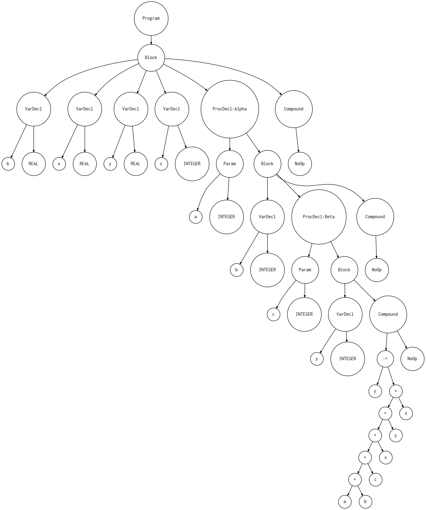

# PL/0 编译器

## 词法分析

## 语法分析
### pl/0 EBNF
```javascript
program : PROGRAM variable SEMI block DOT

block : declarations compound_statement

declarations : (VAR (variable_declaration SEMI)+)*
              | (PROCEDURE ID (LPAREN formal_parameter_list RPAREN)? SEMI block SEMI)*
              | empty

variable_declaration : ID (COMMA ID)* COLON type_spec

formal_params_list : formal_parameters
                    | formal_parameters SEMI formal_parameter_list

formal_parameters : ID (COMMA ID)* COLON type_spec

type_spec : INTEGER | REAL

compound_statement : BEGIN statement_list END

statement_list : statement
                | statement SEMI statement_list

statement : compound_statement
            | assignment_statement
            | empty

assignment_statement : variable ASSIGN expr

empty :

expr : term ((PLUS | MINUS) term)*

term : factor ((MUL | INTEGER_DIV | FLOAT_DIV) factor)*

factor : PLUS factor
        | MINUS factor
        | INTEGER_CONST
        | REAL_CONST
        | LPAREN expr RPAREN
        | variable

variable: ID
```

### AST 的建立

避免某些保留符的出现，如`VAR ; ( )`等
构成简洁明了的语法树

#### AST 各个节点类

- 二元运算符

```python
class BinOp(AST):
    def __init__(self, left, op, right):
        self.left = left
        self.token = self.op = op
        self.right = right
```

- Program

```python
class Program(AST):
    def __init__(self, name, block):
        self.name = name
        self.block = block
```

### 递归下降

一句话总结：递归下降分析的同时，为语法的每一个的节点创建对应的 AST 类，从而构建抽象语法树。

## 语义分析

### 符号(表)的设置

#### 符号 

每个符号都应包含以下几项信息：🙈

```python
class Symbol(object):
    def __init__(self, name, type=None):
        self.name = name #名字 
        self.type = type #类型
```

根据不同类型的符号继承 Symbol ，例如：`ProcedureSymbol`

```python
class ProcedureSymbol(Symbol):
    def __init__(self, name, params=None):
        super().__init__(name)
        # 形参列表！🤓
        self.params = params if params is not None else []
```

#### 符号表 📄

```python

class ScopedSymbolTable(object):
    def __init__(self, scope_name, scope_level, parent_scope=None):
        self._symbols = {} #符号表
        self.scope_name = scope_name #作用域名称 [函数/过程名称]
        self.scope_level = scope_level #作用域等级
        self.parent_scope = parent_scope #指向父级作用域
```

对符号表而言一般有两类操作：

```python

def insert(self, symbol):
    print('Insert: %s' % symbol.name)
    self._symbols[symbol.name] = symbol

#不同等级作用域声明变量时可以重名
#因此添加一个 current_scope 作为flag 🚩
#在查询变量声明时使用

def lookup(self, name, current_scope_only=False):
    # print('Lookup: %s. (Scope name: %s)' % (name, self.scope_name))
    symbol = self._symbols.get(name)

    if symbol is not None:
        return self.scope_level,symbol

    if current_scope_only:
        return None

    # 递归查询
    if self.parent_scope is not None:
        return self.parent_scope.lookup(name)
```

### 嵌套符号表实现作用域

对语法分析得到的 AST 进行深度遍历，检查是否有语义错误😖

```javascript
program Main;
   var b, x, y : real;
   var z : integer;

   procedure Alpha(a : integer);
      var b : integer;

      procedure Beta(c : integer);
         var y : integer;

      begin { Beta }
         y:=a+b+c+x+y+z;
      end;  { Beta }

   begin { Alpha }

   end;  { Alpha }

begin { Main }
end.  { Main }

```



实现嵌套的过程：

当访问 `Program`、`Procedure` 时会有作用域符号表的建立，其中，`Program`是全局的，没有父级作用域，`Procedure`内声明的符号及其形参旨在它的作用域内起作用。

那么声明一个作用域符号表，它需要`current_scope`表示当前所在的作用域（AST 树的深度）🌲

```python
class SemanticAnalyzer(NodeVisitor):
    def __init__(self):
        self.current_scope = None
```

```python
def visit_ProcedureDecl(self, node):
    proc_name = node.proc_name
    #创建一个新的过程/函数符号
    proc_symbol = ProcedureSymbol(proc_name)
    self.current_scope.insert(proc_symbol)

    print('ENTER scope: %s' %  proc_name)
    #每当访问`Procedure`节点时，建立一个新的作用域，其父级
    #作用域指向`current_scope`，同时更新`current_scope`
    procedure_scope = ScopedSymbolTable(
        scope_name=proc_name,
        scope_level=self.current_scope.scope_level + 1,
        parent_scope=self.current_scope
    )
    self.current_scope = procedure_scope

    #插入形参到当前的符号表
    for param in node.params:
        level,param_type = self.current_scope.lookup(param.type_node.value)
        param_name = param.var_node.value
        #声明一个新的值符号
        var_symbol = VarSymbol(param_name, param_type)
        self.current_scope.insert(var_symbol)
        proc_symbol.params.append(var_symbol)
    
    #访问子节点，进行语义分析
    self.visit(node.block_node)
    #当这个节点子树遍历完毕时，也要更新当前的作用域为其父级作用域
    self.current_scope = self.current_scope.enclosing_scope
    print('LEAVE scope: %s' %  proc_name)
```
这样就通过语义分析实现了变量的合法性确认☑
